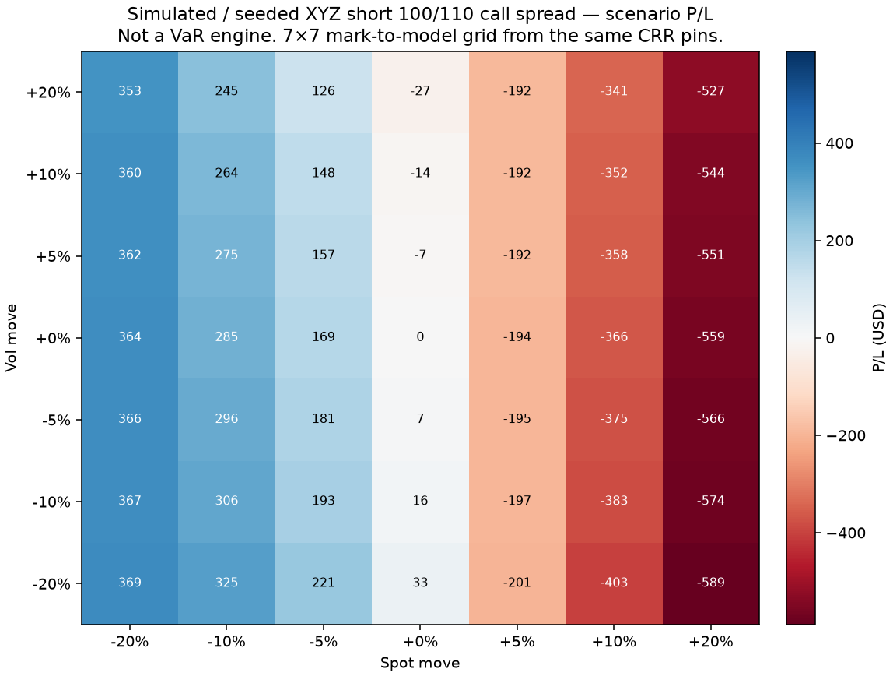
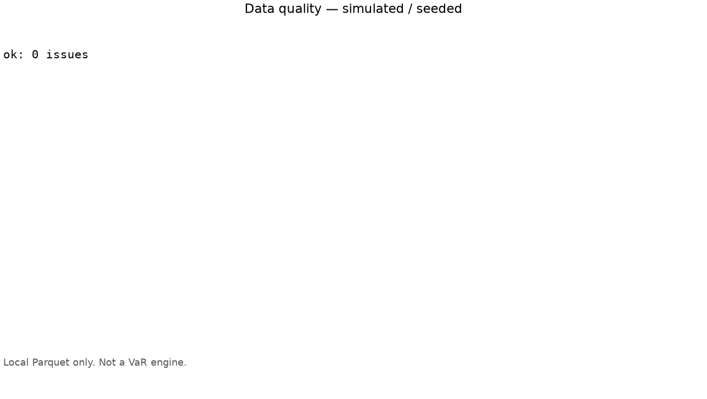
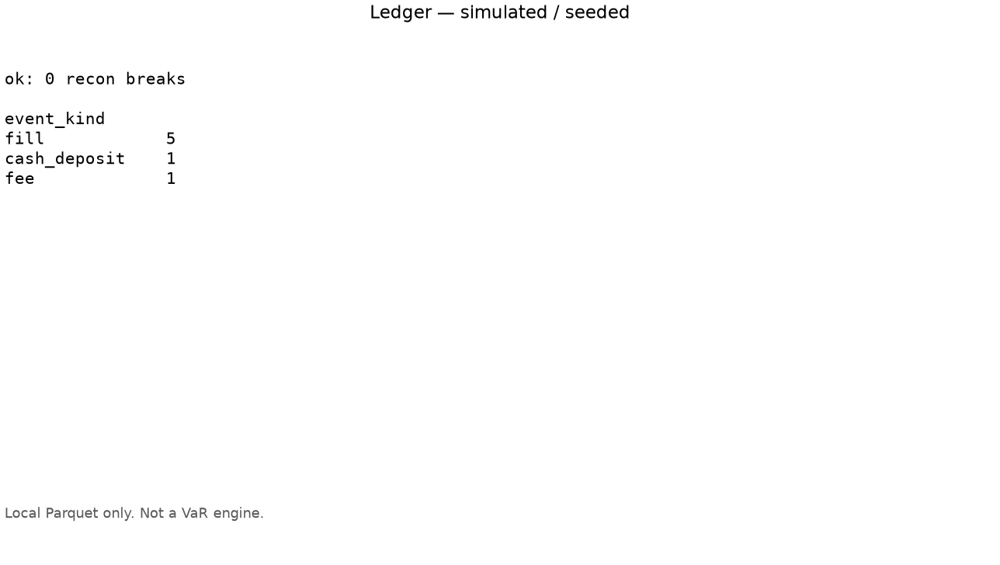
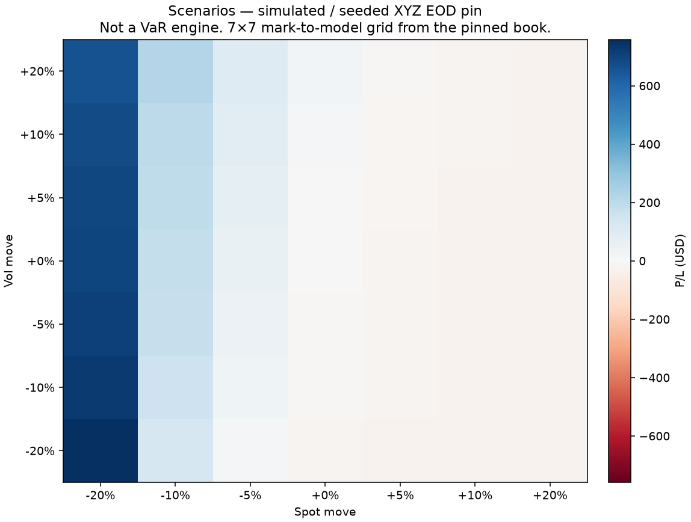

# Options Book Ledger

Snapshots, pin/join data quality, and option lifecycle reconciliation.

[](https://github.com/Suppressor72/options-book-ledger/actions/workflows/ci.yml)

Most public options repos either **price a contract** (QuantLib, vollib, Black-Scholes calculators) or **backtest a strategy** (Optopsy, VectorBT). This project is a small offline **book-operations** stack: joinable Parquet snapshots (account / positions / metrics) with fail-closed pin and join checks, a synthetic fill / expiry / assignment ledger reconciled to open quantity, and a CRR/BS reprice of that book so scenario P/L is computed from the same pins. It is not a QuantLib replacement, not a QuantStats clone, and not a live trading bot.

**Status:** Public. How this grew: [CHANGELOG](CHANGELOG.md).

## What this is / is not

| This is (today) | This is not |
|-----------------|-------------|
| Joinable Parquet snapshots (`account` / `position` / `book_metrics`) with fail-closed pin/join DQ | A QuantLib / vollib replacement |
| Seeded XYZ `optledger demo-build` / `optledger dq` (offline) | A QuantStats tearsheet clone |
| Thin CRR/BS reprice so book metrics come from the same pins | A live trading bot or broker integration |
| Synthetic fill / expiry / assignment ledger reconciled to open quantity (`optledger ledger-recon`) | A 12-page risk / IV-smile dashboard |
| Flow-adjusted TWR, max DD, and time-to-recovery from EOD NLV + deposits (`optledger twr`) | First-party Sharpe / Sortino / Calmar / Ulcer |
| Slim Streamlit: DQ, Ledger, Scenarios (`optledger web`) | A pricer / VaR / IV-smile gallery |

v1 is **options-first**. The snapshot/ledger kernel is typed so another asset class could plug in later; equities, futures, and crypto are **not** in v1.

## Setup

Python 3.12+. [uv](https://docs.astral.sh/uv/) recommended.

```bash
uv sync --extra dev
uv run pytest -q
uv run ruff check optledger tests
uv run ruff format --check optledger tests
uv run mypy optledger
uv run optledger demo-build --out data
uv run optledger dq --data data
uv run optledger ledger-recon --data data
uv run optledger twr --data data
uv sync --extra web
uv run optledger web --data data
```

`demo-build` is idempotent on `fixtures/demo.json` (seed 72, ticker `XYZ`). `dq` exits 0 on that demo and 1 on `fixtures/broken_join.json` (after writing it to Parquet). `ledger-recon` exits 0 on the demo and on `fixtures/ledger_expire_worthless.json` / `fixtures/ledger_assignment.json`, and 1 on `fixtures/ledger_qty_break.json`. Output under `data/` is gitignored. Snapshot families, pins, ledger events, and recon are in [Data contract](#data-contract).

TWR is flow-adjusted from EOD NLV pins and `cash_deposit` events only (fees and fill premiums already sit in marked NLV). Windows are `all`, `ytd`, and `trailing-12` (365 calendar days). **YTD is the TWR of pins whose `as_of` falls in the last pin's calendar year**, not a January-1 NAV interpolation. The demo is pinned weekly from late 2023 into mid-2025, so the three windows differ: `all` covers every pin, `ytd` the last pin's calendar year, and `trailing-12` the trailing 365 days. Every demo number is **simulated / seeded** and is not live performance.

Seeded `optledger twr --data data` after `demo-build` (seed 72):

```
simulated / seeded
window               twr     max_dd   ttr_days
all               -0.44%     -0.72%          —
ytd               -0.11%     -0.11%          —
trailing-12       -0.58%     -0.58%          —
```

Optional extras:

| Extra | Purpose |
|-------|---------|
| `web` | Slim Streamlit — DQ / Ledger / Scenarios (`optledger web`) |
| `ref` | vollib European price/Greeks cross-check tests (skip if missing) |
| `tearsheet` | Optional QuantStats HTML from the TWR series — `optledger tearsheet` (not required) |
| `sql` | DuckDB join/gap queries (pandas is the default) |

`optledger[ref]` installs **vollib only**. QuantLib is a separate skip-if-installed oracle for the American CRR test; it is not a declared extra. Default `uv sync` does not require QuantLib, DuckDB, QuantStats, Streamlit, matplotlib, or network.

## Data contract

Three Parquet families under `--data`, joined on `snapshot_id`:

| Family | Grain | Columns |
|--------|-------|---------|
| `account_snapshot` | one row per pin | `snapshot_id`, `as_of`, `pin_kind`, `nlv`, `cash` |
| `position_snapshot` | legs at that pin | `snapshot_id`, `as_of`, `pin_kind`, `symbol`, `instrument_id`, `right`, `strike`, `expiry`, `qty`, `spot`, `iv`, `model_price`, `delta`, `vega`, `multiplier`, `style` |
| `book_metrics` | derived at that pin | `snapshot_id`, `as_of`, `pin_kind`, `net_delta`, `net_vega`, selected `pnl_spot_*` columns (spot moves at unchanged vol) |

Pins are joinable as-of timestamps: `open` and `eod`. `snapshot_id` is `{YYYY-MM-DD}-{pin_kind}`. `instrument_id` is an opaque key. `optledger dq` fail-closes on missing EOD pins, a `snapshot_id` present in one family but not another, schema gaps, non-positive spots, option IV ≤ 0, zero qty, expiry before `as_of`, unusable option `style`, and dirty (null / NaN / garbage) cells.

Ledger events are first-class yearly Parquet rows under `data/ledger/`, not inferred from position diffs. Kinds: `fill`, `expire_worthless`, `assignment`, `cash_deposit`, `fee`. Columns: `event_id`, `as_of`, `account`, `event_kind`, `symbol`, `instrument_id`, `qty`, `cash`. `optledger ledger-recon` checks cumulative ledger qty vs EOD positions, cumulative ledger cash vs the account cash pin, and `nlv` vs cash plus marked positions. It reports `qty_break` / `cash_break` / `nlv_break` instead of silently fixing them.

## Methods (supporting)

European lots use Black–Scholes–Merton (Merton 1973, continuous dividend yield). American lots use a Cox–Ross–Rubinstein tree (early exercise vs discounted continuation). Unit tests pin published Hull numbers: European call/put with S=42, K=40, r=10%, σ=20%, T=0.5; five-step American put with S=K=50, r=10%, σ=40%, T=5/12 (Hull, *Options, Futures, and Other Derivatives*). This is not a QuantLib or vollib replacement.

The default scenario grid is seven spot moves and the same seven vol moves:

`(-0.20, -0.10, -0.05, 0, +0.05, +0.10, +0.20)`

Each cell is mark-to-model P/L from the same CRR/BS pins. This is **not** a VaR engine. Heavier risk UIs already exist; see Dipesh-Lc and garch-risk below.

TWR is the flow-adjusted index from EOD NLV and `cash_deposit` events described in Setup. First-party output is that index, period return, max drawdown, and time-to-recovery — not Sharpe / Sortino / Calmar / Ulcer.

The figure is a **simulated / seeded** two-contract XYZ short 100/110 call spread (one short 100-strike call, one long 110-strike call).



Regenerate with `uv run --with matplotlib python scripts/render_scenario_heatmap.py`.

## Streamlit (slim)

Three pages only: **Data quality**, **Ledger**, and **Scenarios**. Localhost and local Parquet; refresh re-reads the files. Book/Greeks appear as a compact table on Scenarios. This is not a pricer, VaR engine, or IV-smile gallery.

```bash
uv sync --extra web
uv run optledger demo-build --out data
uv run optledger web --data data
```

Seeded figures of the same DQ / ledger / scenario views (matplotlib mockups, not Streamlit chrome captures):







Regenerate with `uv run --with matplotlib python scripts/render_web_screenshots.py`.

## Project layout

```
optledger/pricing    # pure: BS + CRR + first-order Greeks
optledger/book       # pure: OptionPosition, reprice_book, small scenario grid
optledger/metrics    # pure: TWR + max DD only
optledger/data       # product: Parquet, pins, joins, DQ
optledger/ledger     # product: synthetic lifecycle events
optledger/simulate   # demo path: seeded XYZ book + fills
optledger/cli        # Typer: demo-build, dq, ledger-recon, twr, tearsheet, web
optledger/web        # Streamlit: DQ, Ledger, Scenarios only
tests/
fixtures/            # tiny synthetic JSON (ticker XYZ)
```

`pricing`, `book`, and `metrics` must not import `cli`, `web`, `data`, `ledger`, or extras.

## Architecture

**Pure** layers (`pricing`, `book`, `metrics`) are functions on numbers and frozen dataclasses. They do not import Parquet, the CLI, Streamlit, or extras (`vollib`, QuantLib, DuckDB, QuantStats). **Product** layers (`data`, `ledger`, `cli`, `web`) own pins, joins, recon, and the UI. `simulate` is the seeded XYZ demo path only. `tests/test_pricing_imports.py` walks the AST so the fence stays green.

Book reprice marks lots with European BSM or American CRR. `demo-build` writes `book_metrics` at the same `snapshot_id` as the position pin. Ledger recon does not call the pricer; it checks qty, cash, and NLV against the pins.

## How to extend

These seams exist so a later slice can plug in without rewriting DQ or recon. **Neither plugin is in v1.**

- **Different pricer:** `reprice_book` expects a price/Greeks result per lot. A later adapter (QuantLib, a custom model) would implement that shape and be selected at reprice time. Snapshot families, pins, and ledger recon stay the same.
- **Another asset class:** `instrument_id` is already an opaque key. Ledger rows do not store call/put; those live on `position_snapshot`. Expire-worthless and assignment are the options-specific events. An equity or futures plugin would add its own fields and event kinds — do not add that plugin now.

## Limitations

v1 is synthetic XYZ generated offline. There is no broker export, live account file, or network fetch in the demo path. Charts and CLI numbers are **simulated / seeded**, not live performance. The 7×7 grid is a point reprice, not VaR/CVaR. Equities, futures, and crypto are out of scope. Optional extras (`web`, `ref`, `tearsheet`, `sql`) are not required for `uv sync`. This software is not investment advice.

## License

MIT. Not investment advice. No warranty that this software is suitable for live trading.

## See also

- [QuantLib](https://www.quantlib.org/) — industrial pricing
- [vollib](https://pypi.org/project/vollib/) — fast European price / IV / Greeks
- [QuantStats](https://github.com/ranaroussi/quantstats) — return-series tearsheets
- Typical Streamlit Black–Scholes demos — single-contract pricers; this UI is DQ / ledger / scenarios only
- [Dipesh-Lc/derivatives-pricing-engine](https://github.com/Dipesh-Lc/derivatives-pricing-engine) — heavier portfolio / VaR Streamlit
- [garch-risk-analytics](https://github.com/Aneesh2409/garch-risk-analytics) — GARCH VaR / full-reval stress
